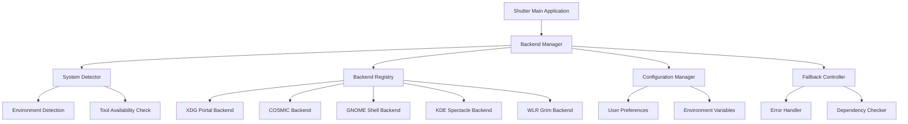
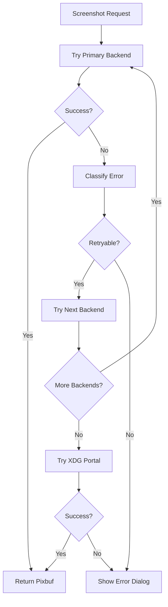

# Design Document

## Overview

This design document outlines the architecture for modernizing Shutter's screenshot system to provide robust Wayland support with intelligent backend detection and fallback mechanisms. The system will automatically detect the desktop environment and available screenshot tools, then select the optimal backend while providing comprehensive error handling and user configuration options.

The design builds upon the existing Shutter architecture while introducing a new Backend Manager system that centralizes backend detection, selection, and execution logic. This approach maintains backward compatibility while significantly improving Wayland support and user experience.

## Architecture

### High-Level Architecture



### Component Interaction Flow

1. **Initialization Phase**: System Detector scans environment and available tools
2. **Registration Phase**: Backend Registry builds prioritized list of available backends
3. **Configuration Phase**: Configuration Manager applies user preferences and environment overrides
4. **Execution Phase**: Backend Manager selects and executes appropriate backend
5. **Fallback Phase**: If primary backend fails, Fallback Controller tries alternatives

## Components and Interfaces

### Backend Manager (`Shutter::Screenshot::BackendManager`)

The central orchestrator that coordinates all screenshot operations.

**Interface:**
```perl
package Shutter::Screenshot::BackendManager;

sub new($class, $screenshooter)
sub initialize()
sub take_screenshot($type, $options)
sub get_available_backends()
sub get_current_backend()
sub set_preferred_backend($backend_name)
sub refresh_backends()
```

**Responsibilities:**
- Coordinate backend detection and selection
- Execute screenshot operations with fallback logic
- Manage configuration and user preferences
- Handle errors and provide user feedback

### System Detector (`Shutter::Screenshot::SystemDetector`)

Detects system environment and available screenshot tools.

**Interface:**
```perl
package Shutter::Screenshot::SystemDetector;

sub new()
sub detect_session_type()
sub detect_desktop_environment()
sub detect_compositor()
sub scan_available_tools()
sub get_system_info()
```

**Detection Logic:**
- Session Type: Check `$ENV{XDG_SESSION_TYPE}` (x11/wayland)
- Desktop Environment: Parse `$ENV{XDG_CURRENT_DESKTOP}`, `$ENV{XDG_SESSION_DESKTOP}`
- Compositor: Detect specific compositors (mutter, kwin, cosmic-comp, sway, etc.)
- Tool Availability: Use `File::Which` to check for binary existence

### Backend Registry (`Shutter::Screenshot::BackendRegistry`)

Maintains registry of available backends with priority ordering.

**Interface:**
```perl
package Shutter::Screenshot::BackendRegistry;

sub new()
sub register_backend($backend)
sub get_backends_for_environment($env_info)
sub get_backend_by_name($name)
sub get_priority_list()
sub update_priorities($user_preferences)
```

**Backend Priority Logic:**
1. **COSMIC Environment**: cosmic-screenshot → xdg-portal → fallbacks
2. **GNOME Environment**: gnome-shell → xdg-portal → fallbacks  
3. **KDE Environment**: spectacle → xdg-portal → fallbacks
4. **wlroots Environment**: grim+slurp → xdg-portal → fallbacks
5. **Generic Wayland**: xdg-portal → available tools
6. **X11 Environment**: existing X11 backends

### Configuration Manager (`Shutter::Screenshot::ConfigManager`)

Handles user preferences and environment variable overrides.

**Interface:**
```perl
package Shutter::Screenshot::ConfigManager;

sub new()
sub load_preferences()
sub save_preferences()
sub get_backend_preference()
sub set_backend_preference($backend)
sub get_environment_overrides()
sub apply_configuration($backend_registry)
```

**Configuration Sources (in priority order):**
1. Environment variables (`SHUTTER_FORCE_PORTAL`, `SHUTTER_PREFER_COSMIC`, etc.)
2. User preferences (stored in GSettings/config file)
3. System defaults based on detected environment

### Base Backend Interface (`Shutter::Screenshot::Backend::Base`)

Abstract base class defining the common interface for all backends.

**Interface:**
```perl
package Shutter::Screenshot::Backend::Base;

sub new($class, $name)
sub is_available()
sub get_supported_types()
sub take_screenshot($type, $options)
sub get_capabilities()
sub get_name()
sub get_priority_for_environment($env_info)
```

**Screenshot Types:**
- `fullscreen`: Capture entire desktop
- `selection`: Interactive area selection
- `window`: Capture specific window
- `monitor`: Capture specific monitor

### Fallback Controller (`Shutter::Screenshot::FallbackController`)

Manages fallback logic and error recovery.

**Interface:**
```perl
package Shutter::Screenshot::FallbackController;

sub new($backend_registry)
sub execute_with_fallback($screenshot_request)
sub handle_backend_failure($backend, $error)
sub get_next_backend($current_backend, $env_info)
sub should_retry($error_type)
```

**Fallback Strategy:**
1. Try primary backend based on environment/preferences
2. On failure, try next available backend in priority order
3. Always try xdg-portal as final fallback on Wayland
4. Provide clear error messages if all backends fail

### Dependency Checker (`Shutter::Screenshot::DependencyChecker`)

Checks for missing dependencies and provides installation guidance.

**Interface:**
```perl
package Shutter::Screenshot::DependencyChecker;

sub new()
sub check_dependencies()
sub get_missing_tools()
sub get_installation_instructions($tool, $distro)
sub suggest_alternatives($missing_tools)
```

## Data Models

### System Information Model

```perl
{
    session_type => 'wayland',           # x11 | wayland
    desktop_environment => 'gnome',      # gnome | kde | cosmic | sway | other
    compositor => 'mutter',              # mutter | kwin | cosmic-comp | sway | other
    distribution => 'ubuntu',            # ubuntu | fedora | arch | other
    available_tools => {
        'cosmic-screenshot' => '/usr/bin/cosmic-screenshot',
        'spectacle' => '/usr/bin/spectacle',
        'grim' => '/usr/bin/grim',
        'slurp' => '/usr/bin/slurp',
        # ...
    }
}
```

### Backend Information Model

```perl
{
    name => 'cosmic',
    class => 'Shutter::Screenshot::COSMIC',
    supported_types => ['fullscreen', 'selection'],
    capabilities => {
        cursor_support => 1,
        delay_support => 1,
        interactive => 1,
    },
    requirements => ['cosmic-screenshot'],
    priority_environments => ['cosmic'],
    is_available => 1,
}
```

### Screenshot Request Model

```perl
{
    type => 'selection',                 # fullscreen | selection | window | monitor
    options => {
        include_cursor => 1,
        delay => 2000,                   # milliseconds
        monitor_id => 0,                 # for monitor type
        window_id => 12345,              # for window type
    },
    preferred_backend => 'auto',         # auto | cosmic | gnome | kde | portal | grim
}
```

### Configuration Model

```perl
{
    backend_preference => 'auto',        # auto | cosmic | gnome | kde | portal | grim
    fallback_enabled => 1,
    timeout_ms => 30000,
    show_dependency_dialogs => 1,
    environment_overrides => {
        'SHUTTER_FORCE_PORTAL' => 0,
        'SHUTTER_PREFER_COSMIC' => 0,
        'SHUTTER_SKIP_PORTAL' => 0,
    }
}
```

## Error Handling

### Error Classification

1. **Backend Unavailable (Code: 1)**: Backend binary not found or not functional
2. **Permission Denied (Code: 2)**: Insufficient permissions for screenshot operation
3. **User Cancelled (Code: 5)**: User cancelled interactive operation
4. **Timeout (Code: 6)**: Operation timed out
5. **Generic Error (Code: 9)**: Other errors (D-Bus failures, file I/O errors, etc.)

### Error Recovery Strategy



### User Feedback Strategy

- **Missing Dependencies**: Show installation dialog with distro-specific commands
- **Permission Issues**: Guide user through permission setup
- **All Backends Failed**: Provide troubleshooting steps and support information
- **User Cancellation**: Silent handling, no error dialogs

## Testing Strategy

### Unit Tests

1. **System Detection Tests**
   - Mock environment variables and test detection logic
   - Test tool availability checking with mock filesystem
   - Verify correct priority ordering for different environments

2. **Backend Tests**
   - Test each backend's availability detection
   - Mock backend execution and verify correct option handling
   - Test error handling and return codes

3. **Configuration Tests**
   - Test preference loading/saving
   - Test environment variable override logic
   - Test configuration validation

4. **Fallback Logic Tests**
   - Test fallback chain execution
   - Test error classification and retry logic
   - Test timeout handling

### Integration Tests

1. **End-to-End Screenshot Tests**
   - Test complete screenshot workflow in different environments
   - Test backend switching and fallback behavior
   - Test configuration changes and their effects

2. **Dependency Tests**
   - Test behavior with missing tools
   - Test installation guidance accuracy
   - Test dynamic tool detection after installation

### Mock Testing Framework

Create mock implementations for testing:
- `MockSystemDetector`: Simulate different environments
- `MockBackend`: Simulate backend success/failure scenarios
- `MockFileSystem`: Test tool availability without actual binaries

### Test Environment Setup

```perl
# Test configuration for different scenarios
my $test_environments = {
    cosmic_complete => {
        XDG_SESSION_TYPE => 'wayland',
        XDG_CURRENT_DESKTOP => 'COSMIC',
        available_tools => ['cosmic-screenshot', 'grim', 'slurp'],
    },
    gnome_minimal => {
        XDG_SESSION_TYPE => 'wayland', 
        XDG_CURRENT_DESKTOP => 'GNOME',
        available_tools => [],  # Test fallback to portal
    },
    kde_full => {
        XDG_SESSION_TYPE => 'wayland',
        XDG_CURRENT_DESKTOP => 'KDE',
        available_tools => ['spectacle', 'grim', 'slurp'],
    },
};
```

## Implementation Phases

### Phase 1: Core Infrastructure
- Implement Backend Manager and System Detector
- Create base backend interface and registry
- Add configuration management

### Phase 2: Backend Modernization  
- Enhance existing backends (COSMIC, GNOME, KDE, WLR)
- Implement unified error handling
- Add comprehensive logging

### Phase 3: User Experience
- Add dependency checking and installation guidance
- Implement preferences UI
- Add comprehensive testing

### Phase 4: Optimization
- Performance optimization
- Advanced fallback strategies
- Extended platform support

This design provides a robust, extensible foundation for Shutter's Wayland screenshot capabilities while maintaining simplicity and reliability.